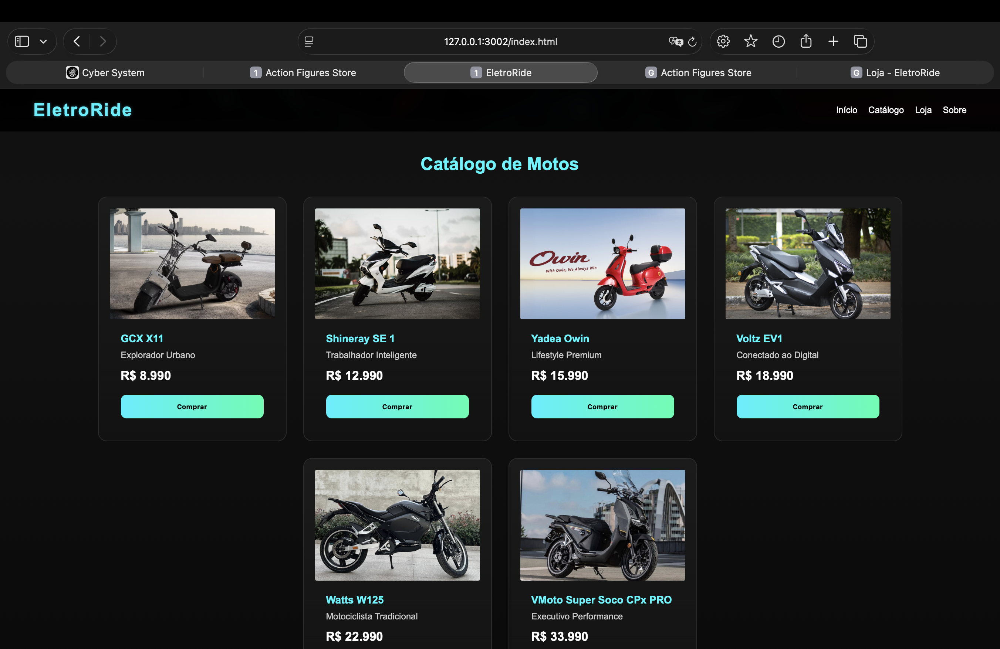
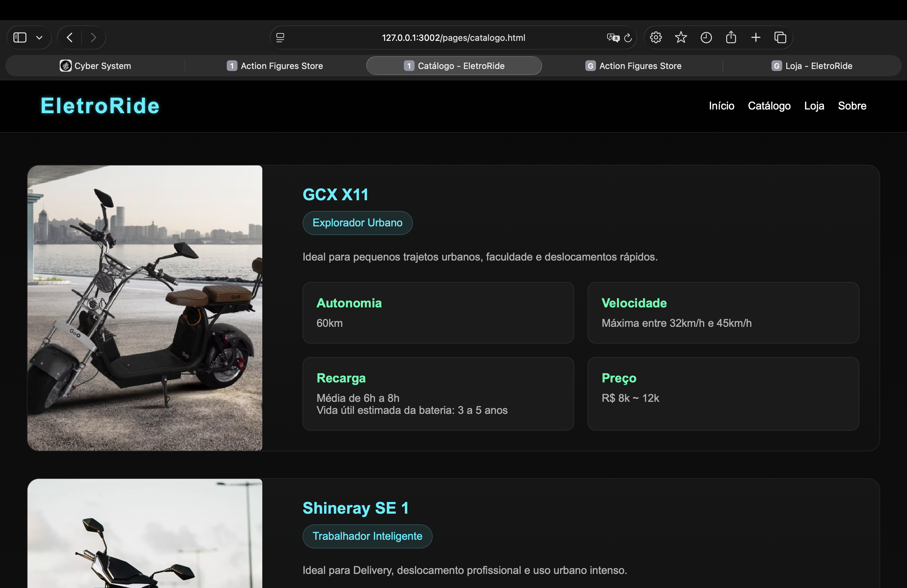
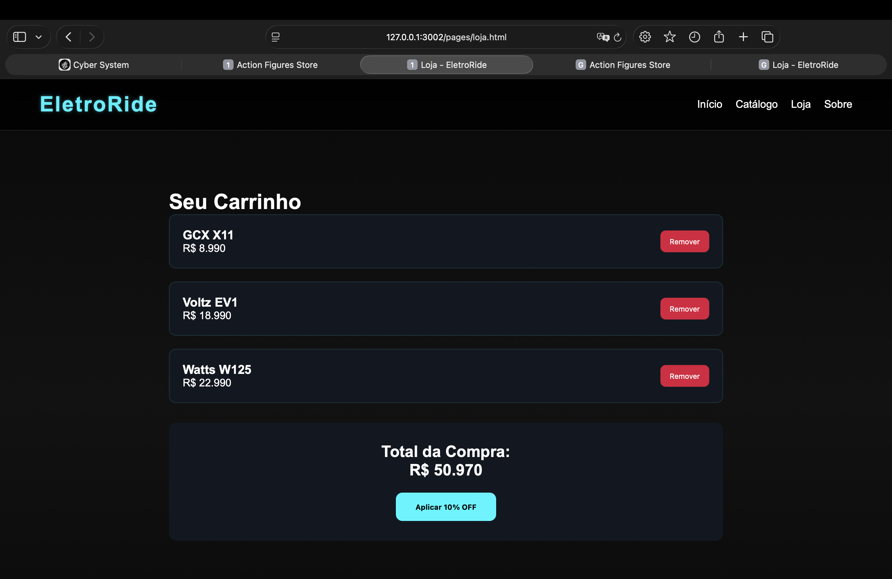

# EletroRide

Projeto de ecommerce de motos elétricas desenvolvido para a disciplina de Web Development da FIAP.

## 🚀 Tecnologias
- HTML
- CSS
- JavaScript
- DOM
- Reduce
- Git/GitHub

## ⚡ Funcionalidades

- Cards de produtos com DOM
- Carrinho de compras
- Cálculo total com Reduce
- Desconto de 10%
- Aba de Catálogo para cativar cada perfil de cliente (persona)
- Responsividade
- Navegação entre páginas

## 🧠 Conceitos aplicados

- Manipulação do DOM
- Arrays e Objetos
- forEach()
- reduce()
- Eventos
- Responsividade
- Estrutura semântica HTML5
- Organização modular
- Git Flow básico

---

## 🖼️ Preview

### 🖥️ Tela Inicial

Tela principal inspirada em interfaces HUD tecnológicas com design neon e efeito futurista/moderna.

### 💻 Principais produtos do Ecommerce

Integração de opções variadas pra diversos estilos e própositos do cliente

### 🛵 Catálogo dinâmico

Tela de Catálogo dinâmico explorando e detalhando os produtos pra atingir variadas personas (ou usuários/clientes) com base no perfil de uso, gosto e finalidade

### 🛒 Loja funcional

Utilização da Manipulação do DOM, Arrays e Objetos, forEach() ereduce() para desenvolver uma loja com função funcional de adicionar e excluir produtos salvos no código

### 👤 Tela Sobre

Conclusão da interface com personalização, identidade visual e finalidade do projeto.

---
## 👨‍💻 Desenvolvido por e para
- Alyson Souto
- Checkpoint 3 - Web Development - FIAP

## 🌐 Deploy

GitHub Pages:
https://alyson-021.github.io/cp3-web-ecommerce-motos-eletricas/
---

